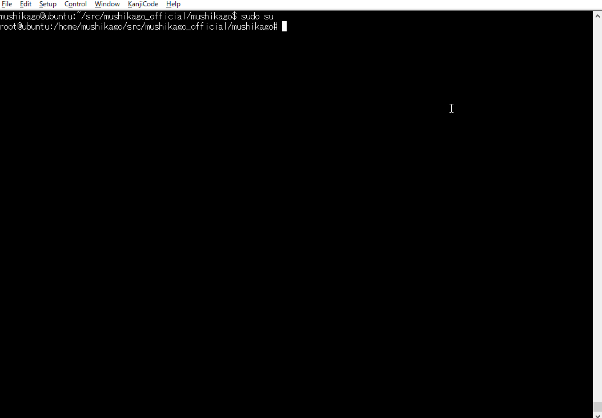
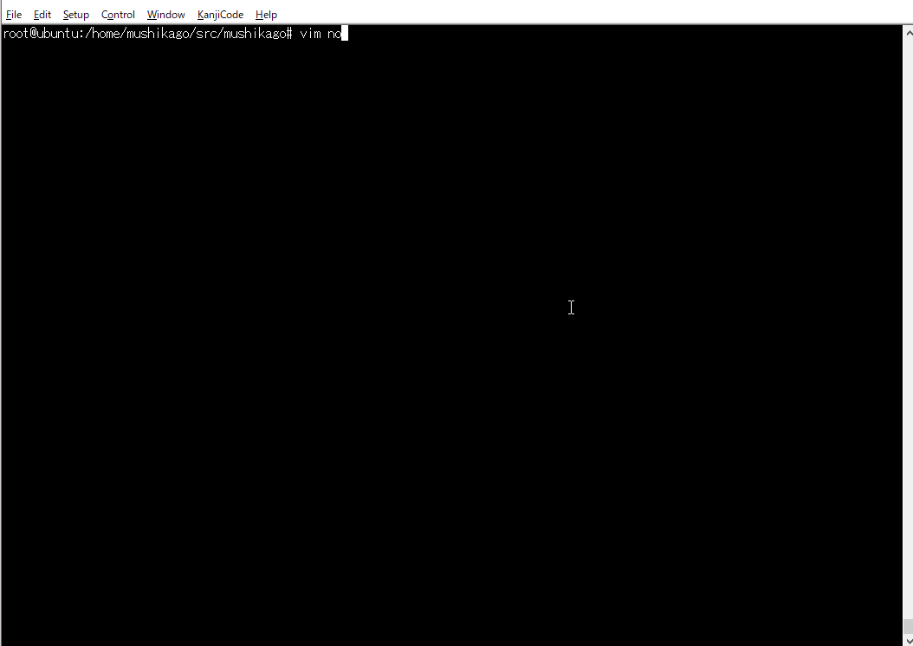

#   
 /$$      /$$ /$$   /$$  /$$$$$$  /$$   /$$ /$$$$$$ /$$   /$$  /$$$$$$   /$$$$$$   /$$$$$$ 
| $$$    /$$$| $$  | $$ /$$__  $$| $$  | $$|_  $$_/| $$  /$$/ /$$__  $$ /$$__  $$ /$$__  $$
| $$$$  /$$$$| $$  | $$| $$  \__/| $$  | $$  | $$  | $$ /$$/ | $$  \ $$| $$  \__/| $$  \ $$
| $$ $$/$$ $$| $$  | $$|  $$$$$$ | $$$$$$$$  | $$  | $$$$$/  | $$$$$$$$| $$ /$$$$| $$  | $$
| $$  $$$| $$| $$  | $$ \____  $$| $$__  $$  | $$  | $$  $$  | $$__  $$| $$|_  $$| $$  | $$
| $$\  $ | $$| $$  | $$ /$$  \ $$| $$  | $$  | $$  | $$\  $$ | $$  | $$| $$  \ $$| $$  | $$
| $$ \/  | $$|  $$$$$$/|  $$$$$$/| $$  | $$ /$$$$$$| $$ \  $$| $$  | $$|  $$$$$$/|  $$$$$$/
|__/     |__/ \______/  \______/ |__/  |__/|______/|__/  \__/|__/  |__/ \______/  \______/


<p align="center">
<a href="https://twitter.com/TechKeg"></a>
</p>

Mushikago is an automatic penetration testing tool using game AI, which focuses on the verification of post-exploit among penetration testing tools. 

## Features
- Full Automatic penetration testing tool
- Device detection
- IT penetration testing
- ICS penetration testing

## Abstract
  Mushikago uses game AI technology to select and execute the most appropriate test content based on the environment in spot. The application of game AI technology to security products is new, and our work has shown that game AI is most suitable for penetration testing, where the content needs to change depending on the environment. In addition, Mushikago can automatically perform penetration testing in mixed environments of IT and OT(ICS), and can visualize and report the acquired device, account, and network information. The test contents are also displayed in a format consistent with MITRE ATT&CK. This allows the user to perform penetration testing at a certain level without manual intervention. 


## Operation check environment:
- Hardware
  - Machine: Raspberry Pi 4 Model B 4GB/8GB
  - OS: Ubuntu Server 20.04.2 LTS
- Software
  - python3
  - nmap
  - metasploit
  - arp-scan
  - arp-scan-windows (https://github.com/QbsuranAlang/arp-scan-windows-)
  - wes.py
  - masscan
  - powershell empire 3.x
  - tshark
- Python-module
  - python-nmap
  - pymetasploit3
  - mac-vendor-lookup
- WebUI (Dashborad)


## Usage
#### step 1. Launch Metasploit API
```
# ./msfrpc.sh
```


#### step 2-(a). Mushikago execution (Target system is IT)
```
# python3 main goap/actions-it.json
```

   


#### step 2-(b). Mushikago execution (Target system is OT)
```
# python3 main goap/actions-ics.json
```


#### step 3. Lanch the dashboard
```
# 
```

#### step 4. Check of nodes.json
```
ex) # vim nodes.json
```

   

The information collected by the penetration testing is stored in nodes.json.


#### step 5. Check of dashborad

We can check the penetration test information from the dashboard.
- Network Overview
- Device list
- acquired data list
- Penetration testing process tree (Display along MITRE ATT&CK)


Recommended to run as root.

**Acknowledgement:** This code was created for personal use with hosts you able to hack/explore by any of the known bug bounty program. Use it at your own risk.

## Contents of Penetration testing
- Collecting device information
  - OS
  - NIC vendor
  - Open TCP/IP port
- Collecting User account detection
  - Local user account
  - Local user account password & hash
  - Domain user account
  - Domain user account password & hash
- Collecting Network information
  - IP address information assigned to the NIC
  - Established network
- Collecting Network drive
- Capturing Network
  - Save as pcap file
- Collecting Secret file 
  - Pre-designated file (mushikago.txt)
- Collecting Process list
- Collecting Security product process
  - AntiVurus Software
    - Panda
    - Kaspersky
    - Tanium
    - AVG/AVAST
    - SEP (Symantec Endpoint Protection)
    - Windows Defender
    - McAfee
    - Sophos
    - Malwarebytes
  - EDR (Endpoint Detection & Response)
    - Carbon Black
    - CrowdStrike
    - FireEye
    - ESET
    - F-Secure
- Post-exploitation
  - Lateral Movement
    - Exploiting vulnerability
    - SMB
    - wmic
- ICS detection
  - ICS Protocol identify
  - ICS vendor identify


## Future Works:
- Add more exploit module
- Improving the goap algorithm
- Improved scan function
- Improved dashboard
- Add more ICS protocols to identify

## Licence:
- Apache License 2.0

## Developer:
- Powder Keg Technologies
- https://www.powderkegtech.com/
- https://twitter.com/TechKeg
- https://www.youtube.com/channel/UCcBHUaYYkqyW8fjbIjiY1ug

